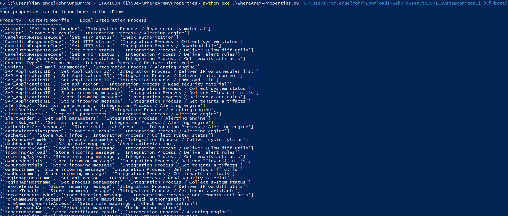

# What is this?
This is a small helper tool to quickly get an overview over all Exchange Properties for an iFlow for SAP CPI (Cloud Platform Integration).

# Example output

# How to use
You will need to download the iFlow to your local machine. 
Then run the script via
> python WhereAreMyProperties.py *PathToYourZIPFile*

for example

> python .\WhereAreMyProperties.py 'C:\Users\jan.engelmohr\Downloads\Webbrowser_to_CPI_SystemMonitor_1.0.5-beta01.zip'

The output will look like in the screenshot. The first column is the name of the Property, the second column is the name of the Content Modifier and the third column is the Integration Process where the Content Modifier can be found.

# Known issues
Technically speaking the script does not only extract Properties but also headers, etc. 
Also the code is quite messy, sorry for that. This is just a quick hack because I was exhausted of finding the Property usages manually in iFlows.

This is good enough for now though I guess. Feel free to send me PRs though :-)

# License
Apache. Use for whatever you want (commercial, non-commercial, ...) ;-)

# Special Thanks
Thank you to ITARICON GmbH, Dresden and their Integration Team for the useful feedback!
